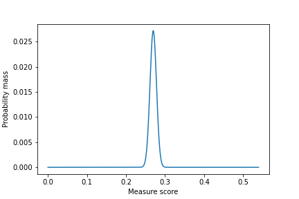
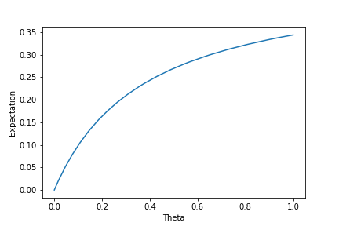

# BinaryBaselines

BinaryBaselines is a Python package for binary classification. 

## Installation

Use the package manager [pip](https://pip.pypa.io/en/stable/) to install the package

```bash
pip install BinaryBaselines
```

or for Windows users

```bash
python -m pip install BinaryBaselines
```


## Method
To properly assess the performance of a binary classification model, the score of a chosen measure should be compared with the score of a 'simple' baseline. E.g. an accuracy of 0.9 isn't that great if a model (without knowledge) attains an accuracy of 0.88. 

### Basic baseline
Let `M`  be the total number of samples, where `P` are positive and `N` are negative. Let `θ_star = round(θ * M) / M`. Randomly shuffle the samples and label the first `θ_star * M` samples as `1` and the rest as `0`. This gives a baseline for each `θ` in `[0,1]`. Our package can optimize (maximize and minimize) the baseline. 

## Reasons to use
This package contains multiple functions. Let `true_labels` be the actual labels and `predicted_labels` be the labels predicted by a model.

If: 
* You want to use an included measure --> `measure_score(true_labels, predicted_labels, measure)`
* You want to get statistics of a baseline --> `basic_baseline_statistics(theta, true_labels, measure = possible_names)`
* You want to get statistics of the optimal baseline --> `optimized_basic_baseline(true_labels, measure = possible_names)`

### List of all included measures
|  Measure  | Definition  |
|---|:---:|
| TP |TP|
| TN | TN|
| FP | FP|
| FN | FN|
| TPR | TP / P|
| TNR | TN / N|
| FPR | FP / N|
| FNR | FN / P|
| PPV | TP / (TP + FP)|
| NPV | TN / (TN + FN)|
| FDR | FP / (TP + FP)|
| FOR | FN / (TN + FN)|
| ACC, ACCURACY | (TP + TN) / M|
| BACC, BALANCED ACCURACY |(TPR + TNR) / 2 |
| FBETA, FSCORE, F, F BETA, F BETA SCORE, FBETA SCORE | ((1 + β<sup>2</sup>) * TP) / ((1 + β<sup>2</sup>) * TP + β<sup>2</sup> * FN + FP)|
| MCC, MATTHEW, MATTHEWS CORRELATION COEFFICIENT | (TP * TN - FP * FN) / (sqrt((TP + FP) * (TN + FN) * P * N)) |
| BM, BOOKMAKER INFORMEDNESS, INFORMEDNESS | TPR + TNR - 1|
| MK | PPV + NPV - 1|
| COHEN, COHENS KAPPA, KAPPA | (P<sub>o</sub> - P<sub>e</sub>) / (1 - P<sub>e</sub>) with P<sub>o</sub> = (TP + TN) / M and <br> P<sub>e</sub> = ((TP + FP) / M) * (P / M) + ((TN + FN) / M) * (N / M)|
| G1, GMEAN1, G MEAN 1, FOWLKES-MALLOWS, FOWLKES MALLOWS, FOWLKES, MALLOWS | sqrt(TPR * PPV)  |
| G2, GMEAN2, G MEAN 2 | sqrt(TPR * TNR) |
| TS, THREAT SCORE, CRITICAL SUCCES INDEX, CSI | TP / (TP + FN + FP)|
| PT, PREVALENCE THRESHOLD | (sqrt(TPR * FPR) - FPR) / (TPR - FPR)|


## Usage

As example, we first generate the true and predicted labels.
```python
import random 
random.seed(123) # To ensure similar outputs

predicted_labels = random.choices((0,1), k = 10000, weights = (0.99, 0.1))
true_labels = random.choices((0,1), k = 10000, weights = (0.99, 0.1))
```
---
### Measure performance
In general, to determine the score of a measure, use `measure_score(true_labels, predicted_labels, measure, beta = 1)`.

#### Input
* `true_labels, predicted_labels` should both be binary lists or vectors with the same length. It is assumed that there is at least one positive and negative.
* `measure`  should be a string containing one of the measures from the list.
* `beta` is only used as parameter for `FBETA`.

#### Output
The function `measure_score` outputs the score of the given measure.

#### Example
To examine the performance of the predicted labels, we measure the markedness (MK) and F<sub>2</sub> score (FBETA).

```python
import BinaryBaselines

# Measuring markedness (MK):
print('Markedness: {:06.4f}'.format(measure_score(true_labels, predicted_labels, measure = 'MK')))

# Measuring FBETA for beta = 2:
print('F2 Score: {:06.4f}'.format(measure_score(true_labels, predicted_labels, measure = 'FBETA', beta = 2)))
```
This returns as output
```python
Markedness: 0.0092
F2 Score: 0.1007
```

Note that `FBETA` is the only measure that requires additional parameter values.

---

### Get basic baseline
In general, to obtain the shuffle baseline use `basic_baseline_statistics(theta, true_labels, measure, beta = 1)`.

#### Input
* `theta` is a parameter of the shuffle baseline. Must be in `[0,1]`.
* `true_labels` should be a binary list or vector. It is assumed that there is at least one positive and negative.
* `measure`  should be a string containing one of the measures from the list.
* `beta` is only used as parameter for `FBETA`.

#### Output
The function `basic_baseline_statistics` gives the following output:

* `Distribution` is the pmf of the measure, given by: `pmf_Y(y, theta = theta_star)`, where `y` is a measure score and `theta` is the parameter of the shuffle baseline. Note that by default, the original given `theta` is used. However, it is possible to use another `theta`.
* `Mean` is the expected baseline.
* `Variance` is the variance of the baseline.
* `Domain` are the attainable measure scores for the given `theta` and `true_labels`.
* `(Fast) Expectation Function` is an expectation function of the baseline that can be used for other values of `theta`. If `Fast Expectation Function` is returned, there exists a theoretical expectation that can be used for fast computation. Otherwise, `Expectation Function` is returned.
* `Variance Function` is the variance function for other values of `theta`.


#### Example
To evaluate the performance of a model, we want to obtain a baseline for the F<sub>2</sub> score (FBETA).

```python
import BinaryBaselines

results_baseline = basic_baseline_statistics(theta = 0.5, true_labels = true_labels, measure = 'FBETA', beta = 2)
```

This gives us the mean and variance of the baseline.
```python
print('Mean: {:06.4f}'.format(results_baseline['Mean']))
print('Variance: {:06.4f}'.format(results_baseline['Variance']))
```
with output 

```python
Mean: 0.2697
Variance: 0.0001
```
Next, we can use `Domain` and `Distribution` to plot the pmf.
```python
import matplotlib.pyplot as plt
pmf_plot = [results_baseline['Distribution'](y) for y in results_baseline['Domain']]
plt.plot(results_baseline['Domain'], pmf_plot)
plt.xlabel('Measure score')
plt.ylabel('Probability mass')
plt.show()
```
with output:



Furthermore, we can use the `Fast Expectation Function` to determine the expectation for **other** `theta` values.
```python
import numpy as np
theta_values = np.arange(0, 1, 1 / sum(true_labels))
expectation_plot = [results_baseline['Fast Expectation Function'](theta) for theta in theta_values]
plt.plot(theta_values, expectation_plot)
plt.xlabel('Theta')
plt.ylabel('Expectation')
plt.show()
```
with output:



---

### Get optimal baseline
In general, to obtain the optimal baseline use `optimized_basic_baseline(true_labels, measure = possible_names, beta = 1)`.

#### Input
* `true_labels` should be a binary list or vector. It is assumed that there is at least one positive and negative.
* `measure`  should be a string containing one of the measures from the list.
* `beta` is only used as parameter for `FBETA`.

#### Output
The function `optimized_basic_baseline` gives the following output:

* `Max Expected Value` is the maximum expected value of all possible `theta` values.
* `Argmax Expected Value` are all `theta_star` values that give the maximum expected value.
* `Min Expected Value` is the minimum expected value of all possible `theta` values.
* `Argmin Expected Value` are all `theta_star` values that give the minimum expected value.

Note that `theta_star = round(theta * M) / M`.

#### Example
To evaluate the performance of a model, we want to obtain the optimal baseline for the F<sub>2</sub> score (FBETA).

```python
import BinaryBaselines

optimal_baseline = optimized_basic_baseline(true_labels, measure = 'FBETA', beta = 1)

print('Max Expected Value: {:06.4f}'.format(optimal_baseline['Max Expected Value']))
print('Argmax Expected Value: {:06.4f}'.format(optimal_baseline['Argmax Expected Value']))
print('Min Expected Value: {:06.4f}'.format(optimal_baseline['Min Expected Value']))
print('Argmin Expected Value: {:06.4f}'.format(optimal_baseline['Argmin Expected Value']))
```
with output

```python
Max Expected Value: 0.1733
Argmax Expected Value: 1.0000
Min Expected Value: 0.0000
Argmin Expected Value: 0.0000
```

---

## License
[MIT](https://choosealicense.com/licenses/mit/)