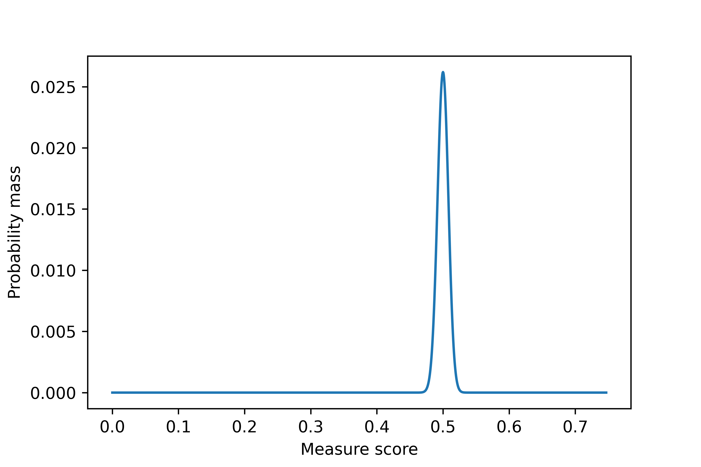

# BinaryBaselines

BinaryBaselines is a Python package for binary classification.

## Installation

Use the package manager [pip](https://pip.pypa.io/en/stable/) to install the package

```bash
pip install BinaryBaselines
```

----
### Windows users

```bash
python -m pip install --upgrade  --index-url https://test.pypi.org/simple/ BinaryBaselines
```
<!-- ```bash
python -m pip install BinaryBaselines
``` -->

or 
```bash
py -m pip install --upgrade  --index-url https://test.pypi.org/simple/ BinaryBaselines
```
<!-- ```bash
py -m pip install BinaryBaselines
``` -->


## Method
To properly assess the performance of a binary classification model, the score of a chosen measure should be compared with the score of a 'simple' baseline. E.g. an accuracy of 0.9 isn't that great if a model (without knowledge) attains an accuracy of 0.88. 

### Basic baseline
Let `M`  be the total number of samples, where `P` are positive and `N` are negative. Let `θ_star = round(θ * M) / M`. Randomly shuffle the samples and label the first `θ_star * M` samples as `1` and the rest as `0`. This gives a baseline for each `θ` in `[0,1]`. Our package can optimize (maximize and minimize) the baseline. 

## Reasons to use
This package contains multiple functions. Let `true_labels` be the actual labels and `predicted_labels` be the labels predicted by a model.

If: 
* You want to determine an included measure --> `measure_score(true_labels, predicted_labels, measure)`
* You want to get statistics of a baseline given `theta` --> `basic_baseline_given_theta(theta, true_labels, measure)`
* You want to get statistics of the optimal baseline --> `optimized_basic_baseline(true_labels, measure)`
* You want the baseline without specifying `theta` --> `basic_baseline(true_labels, measure)`

### List of all included measures
| Measure                                                                  |                                                                               Definition                                                                                |
| ------------------------------------------------------------------------ | :---------------------------------------------------------------------------------------------------------------------------------------------------------------------: |
| TP                                                                       |                                                                                   TP                                                                                    |
| TN                                                                       |                                                                                   TN                                                                                    |
| FP                                                                       |                                                                                   FP                                                                                    |
| FN                                                                       |                                                                                   FN                                                                                    |
| TPR                                                                      |                                                                                 TP / P                                                                                  |
| TNR                                                                      |                                                                                 TN / N                                                                                  |
| FPR                                                                      |                                                                                 FP / N                                                                                  |
| FNR                                                                      |                                                                                 FN / P                                                                                  |
| PPV                                                                      |                                                                             TP / (TP + FP)                                                                              |
| NPV                                                                      |                                                                             TN / (TN + FN)                                                                              |
| FDR                                                                      |                                                                             FP / (TP + FP)                                                                              |
| FOR                                                                      |                                                                             FN / (TN + FN)                                                                              |
| ACC, ACCURACY                                                            |                                                                              (TP + TN) / M                                                                              |
| BACC, BALANCED ACCURACY                                                  |                                                                             (TPR + TNR) / 2                                                                             |
| FBETA, FSCORE, F, F BETA, F BETA SCORE, FBETA SCORE                      |                                            ((1 + β<sup>2</sup>) * TP) / ((1 + β<sup>2</sup>) * TP + β<sup>2</sup> * FN + FP)                                            |
| MCC, MATTHEW, MATTHEWS CORRELATION COEFFICIENT                           |                                                       (TP * TN - FP * FN) / (sqrt((TP + FP) * (TN + FN) * P * N))                                                       |
| BM, BOOKMAKER INFORMEDNESS, INFORMEDNESS                                 |                                                                              TPR + TNR - 1                                                                              |
| MK                                                                       |                                                                              PPV + NPV - 1                                                                              |
| COHEN, COHENS KAPPA, KAPPA                                               | (P<sub>o</sub> - P<sub>e</sub>) / (1 - P<sub>e</sub>) with P<sub>o</sub> = (TP + TN) / M and <br> P<sub>e</sub> = ((TP + FP) / M) * (P / M) + ((TN + FN) / M) * (N / M) |
| G1, GMEAN1, G MEAN 1, FOWLKES-MALLOWS, FOWLKES MALLOWS, FOWLKES, MALLOWS |                                                                             sqrt(TPR * PPV)                                                                             |
| G2, GMEAN2, G MEAN 2                                                     |                                                                             sqrt(TPR * TNR)                                                                             |
| TS, THREAT SCORE, CRITICAL SUCCES INDEX, CSI                             |                                                                           TP / (TP + FN + FP)                                                                           |
| PT, PREVALENCE THRESHOLD                                                 |                                                                  (sqrt(TPR * FPR) - FPR) / (TPR - FPR)                                                                  |


## Usage

As example, we first generate the true and predicted labels.
```python
import random 
random.seed(123) # To ensure similar outputs

predicted_labels = random.choices((0,1), k = 10000, weights = (0.9, 0.1))
true_labels = random.choices((0,1), k = 10000, weights = (0.9, 0.1))
```
---
### Measure performance
In general, to determine the score of a measure, use `measure_score(true_labels, predicted_labels, measure, beta = 1)`.

#### Input
* `true_labels` (list): 1-dimensional boolean list containing the true labels.

* `predicted_labels` (list): 1-dimensional boolean list containing the predicted labels.

* `measure` (string): Measure name, see `all_names_except([''])` for possible measure names.

* `beta` (float): Default is 1. Parameter for the F-beta score.

#### Output
* `float`: The score of the given measure evaluated with the predicted and true labels.

#### Example
To examine the performance of the predicted labels, we measure the markedness (MK) and F<sub>2</sub> score (FBETA).

```python
import BinaryBaselines as bbl

# Measuring markedness (MK):
print('Markedness: {:06.4f}'.format(bbl.measure_score(true_labels, predicted_labels, measure = 'MK')))

# Measuring FBETA for beta = 2:
print('F2 Score: {:06.4f}'.format(bbl.measure_score(true_labels, predicted_labels, measure = 'FBETA', beta = 2)))
```
This returns as output
```python
Markedness: 0.0061
F2 Score: 0.1053
```

Note that `FBETA` is the only measure that requires an additional parameter value.

---

### Get basic baseline given `theta`
To obtain the basic baseline given `theta` use `basic_baseline_given_theta(theta, true_labels, measure, beta = 1)`.

#### Input
* `theta` (float): Parameter for the shuffle baseline.

* `true_labels` (list): 1-dimensional boolean list containing the true labels.

* `measure` (string): Measure name, see `all_names_except([''])` for possible measure names.

* `beta` (float): Default is 1. Parameter for the F-beta score.

#### Output
The function `basic_baseline_given_theta` gives the following output:

* `dict`: Containing `Mean` and `Variance`
    * `Mean` (float): Expected baseline given `theta`.
    * `Variance` (float): Variance baseline given `theta`.


#### Example
To evaluate the performance of a model, we want to obtain a baseline for the F<sub>2</sub> score (FBETA).

```python
results_baseline = bbl.basic_baseline_given_theta(theta = 0.5, true_labels = true_labels, measure = 'FBETA', beta = 2)
```

This gives us the mean and variance of the baseline.
```python
print('Mean: {:06.4f}'.format(results_baseline['Mean']))
print('Variance: {:06.4f}'.format(results_baseline['Variance']))
```
with output 

```python
Mean: 0.2829
Variance: 0.0001
```

------
### Get basic baseline 
To obtain the basic baseline without specifying `theta` use `basic_baseline(true_labels, measure, beta = 1)`.

#### Input
* `true_labels` (list): 1-dimensional boolean list containing the true labels.

* `measure` (string): Measure name, see `all_names_except([''])` for possible measure names.

* `beta` (float): Default is 1. Parameter for the F-beta score.

#### Output
The function `basic_baseline` gives the following output:

* `dict`: Containing `Distribution`, `Domain`, `(Fast) Expectation Function` and `Variance Function`. 

    * `Distribution` (function): Pmf of the measure, given by: `pmf_Y(y, theta)`, where `y` is a measure score and `theta` is the parameter of the shuffle baseline.

    * `Domain` (function): Function that returns attainable measure scores with argument `theta`.

    * `(Fast) Expectation Function` (function): Expectation function of the baseline with `theta` as argument. If `Fast Expectation Function` is returned, there exists a theoretical expectation that can be used for fast computation.

    * `Variance Function` (function): Variance function for all values of `theta`.


#### Example
Next, we determine the baseline without specifying `theta`. This returns a number of functions that can be used for different values of `theta`.

```python
baseline = bbl.basic_baseline(true_labels = true_labels, measure = 'G2', beta = 2)
print(baseline.keys())
```
with output 

```python
dict_keys(['Distribution', 'Domain', 'Fast Expectation Function', 'Variance Function', 'Expectation Function'])
```

To inspect the expected value of `G2` for different `theta` values, we do:
```python
import matplotlib.pyplot as plt
theta_values = np.arange(0, 1 + 0.01, 0.01)
expected_value_plot = [baseline['Expectation Function'](theta) for theta in theta_values]
plt.plot(theta_values, expected_value_plot)
plt.xlabel('Theta')
plt.ylabel('Expected value')
plt.show()
```
with output:



Furthermore, we can use the `Fast Expectation Function` to determine the expectation for **other** `theta` values.
```python
import numpy as np
theta_values = np.arange(0, 1, 1 / sum(true_labels))
expectation_plot = [results_baseline['Fast Expectation Function'](theta) for theta in theta_values]
plt.plot(theta_values, expectation_plot)
plt.xlabel('Theta')
plt.ylabel('Expectation')
plt.show()
```
with output:


---

### Get optimal baseline
In general, to obtain the optimal baseline use `optimized_basic_baseline(true_labels, measure = possible_names, beta = 1)`.

#### Input
* `true_labels` should be a binary list or vector. It is assumed that there is at least one positive and negative.
* `measure`  should be a string containing one of the measures from the list.
* `beta` is only used as parameter for `FBETA`.

#### Output
The function `optimized_basic_baseline` gives the following output:

* `Max Expected Value` is the maximum expected value of all possible `theta` values.
* `Argmax Expected Value` are all `theta_star` values that give the maximum expected value.
* `Min Expected Value` is the minimum expected value of all possible `theta` values.
* `Argmin Expected Value` are all `theta_star` values that give the minimum expected value.

Note that `theta_star = round(theta * M) / M`.

#### Example
To evaluate the performance of a model, we want to obtain the optimal baseline for the F<sub>2</sub> score (FBETA).

```python
optimal_baseline = bbl.optimized_basic_baseline(true_labels, measure = 'FBETA', beta = 1)

print('Max Expected Value: {:06.4f}'.format(optimal_baseline['Max Expected Value']))
print('Argmax Expected Value: {:06.4f}'.format(optimal_baseline['Argmax Expected Value']))
print('Min Expected Value: {:06.4f}'.format(optimal_baseline['Min Expected Value']))
print('Argmin Expected Value: {:06.4f}'.format(optimal_baseline['Argmin Expected Value']))
```
with output

```python
Max Expected Value: 0.1733
Argmax Expected Value: 1.0000
Min Expected Value: 0.0000
Argmin Expected Value: 0.0000
```

---

## License
[MIT](https://choosealicense.com/licenses/mit/)